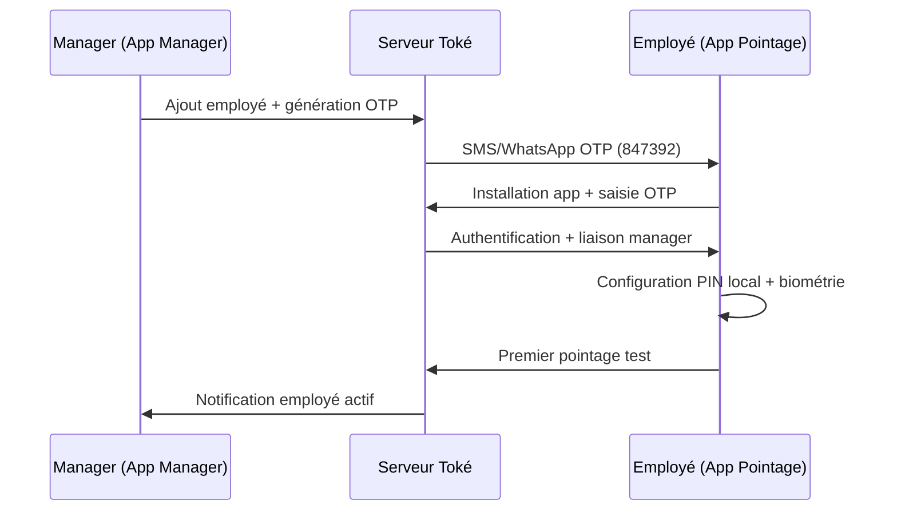
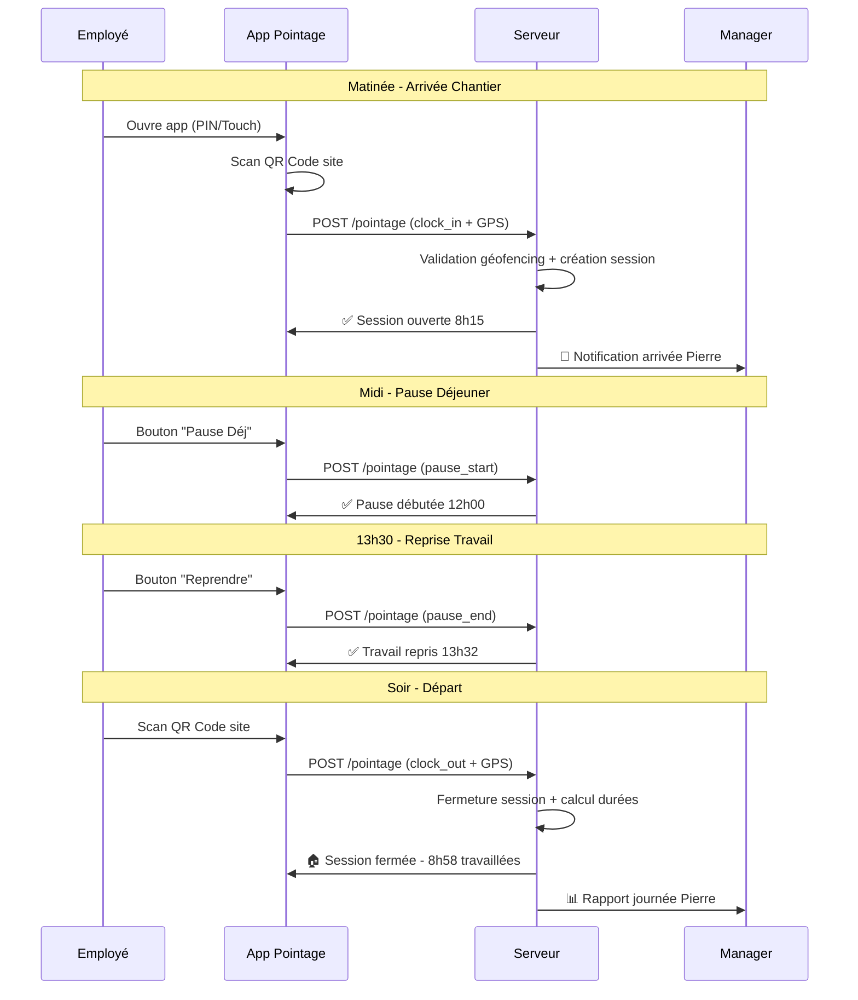
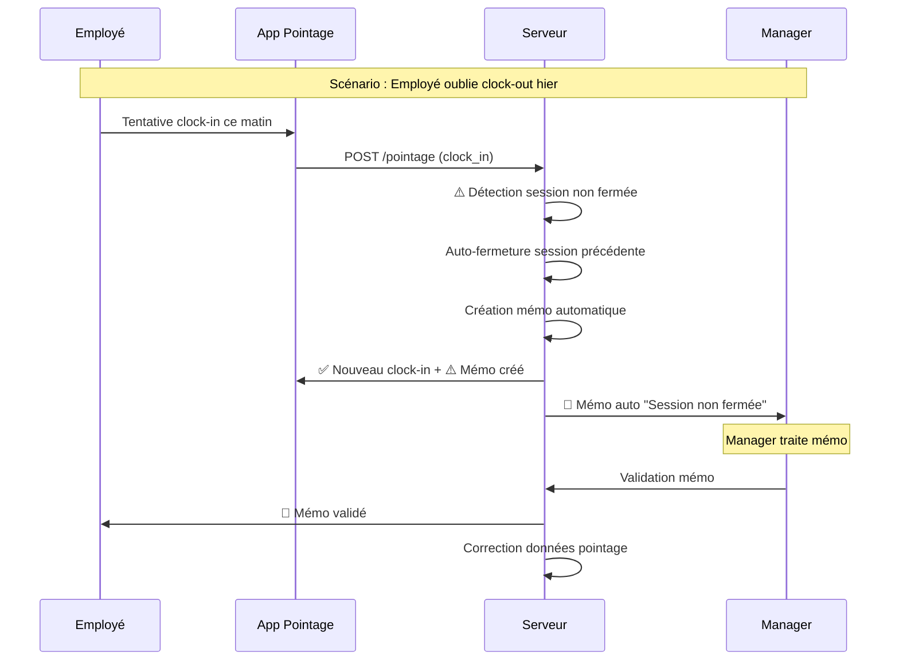
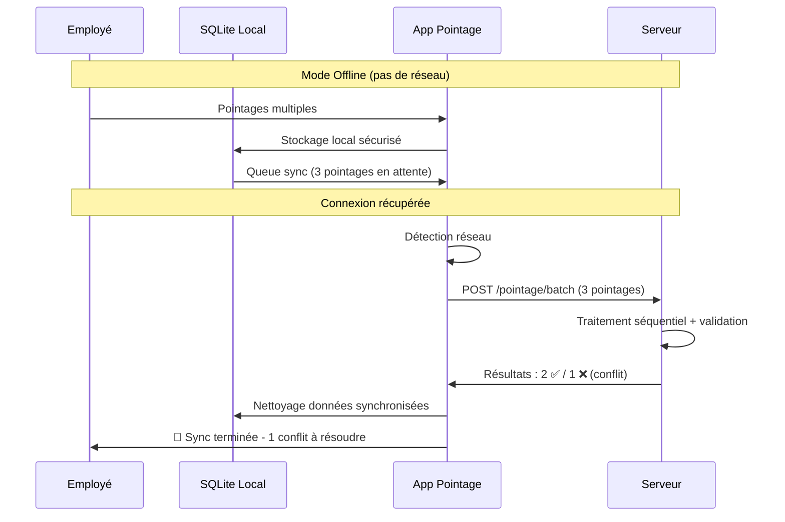

# 📋 TOKÉ - PRÉSENTATION DU POINTAGE EMPLOYÉ

> **Document de Référence Technique v2.0**  
> **Système de Pointage 100% Smartphone pour l'Afrique Centrale**  
> **Architecture Unifiée - Sessions de Travail - Anti-Fraude Intégré**

---

## 🎯 CONCEPT GÉNÉRAL

### 📱 Vision Produit

**Toké transforme le smartphone en badgeuse universelle** permettant aux employés de pointer leur présence via QR Code + GPS, avec une approche **"cancre-proof"** adaptée au marché africain.

### 🔑 Principe Fondamental : **SESSIONS DE POINTAGE**

Contrairement aux systèmes traditionnels basés sur des "journées", Toké gère des **sessions de travail** :

- **Session = Clock-in → Clock-out** avec pauses optionnelles entre
- **Un employé = Une session active maximum** (cohérence garantie)
- **Calculs automatiques** durées travail/pause par session
- **Gestion chevauchements** jour/nuit (gardes, équipes de nuit)

### 🛡️ Sécurité Anti-Fraude

- **QR Code + GPS obligatoires** : Double validation présence
- **Géofencing intelligent** : Polygones complexes par site
- **Détection patterns suspects** : Vitesse, doublons, incohérences
- **Audit trail complet** : Traçabilité légale toute modification

---

## 👥 ACTEURS & RÔLES

### 🏗️ Architecture Utilisateurs Unifiée

Toké utilise une **table `users` unique** avec système de **rôles flexibles** pour supporter tous cas organisationnels.

#### 📋 **Rôles Système Prédéfinis**

| Rôle               | Code             | Permissions                                                                                           | Cas d'Usage                          |
| ------------------ | ---------------- | ----------------------------------------------------------------------------------------------------- | ------------------------------------ |
| **Employé**        | `EMPLOYEE`       | • Pointage<br/>• Création mémos<br/>• Consultation historique personnel                               | Ouvriers, secrétaires, techniciens   |
| **Manager**        | `MANAGER`        | • Pointage personnel<br/>• Gestion équipe<br/>• Validation mémos<br/>• Création sites/QR              | Chefs d'équipe, responsables service |
| **Manager Senior** | `MANAGER_SENIOR` | • Toutes permissions Manager<br/>• Supervision managers<br/>• Escalade mémos<br/>• Analytics avancées | Directeurs, responsables région      |
| **Admin RH**       | `HR_ADMIN`       | • Accès tenant complet<br/>• Gestion utilisateurs<br/>• Configuration système                         | Service RH, comptabilité             |
| **Auditeur**       | `AUDITOR`        | • Pointage multi-sites<br/>• Rapports audit<br/>• Missions temporaires                                | Contrôleurs, inspecteurs             |

#### 🔄 **Combinaisons de Rôles** (Multi-Rôles)

```
Exemple : Pierre = Chef Chantier
├── Rôle MANAGER : Gère 8 ouvriers + crée QR Chantier Nord
└── Rôle EMPLOYEE : Pointe ses propres heures + manager = Directeur Travaux

Exemple : Sophie = Responsable Région
├── Rôle MANAGER_SENIOR : Supervise 3 chefs d'agence
└── Rôle EMPLOYEE : Employée du Directeur National
```

### 🏢 **Hiérarchie Organisationnelle**

**Structure Flexible N-Niveaux** via table `org_hierarchy` :

```
TENANT : BATIX SARL
│
├── Directeur Général (HR_ADMIN + MANAGER_SENIOR)
│   │
│   ├── Directeur Travaux (MANAGER_SENIOR + EMPLOYEE)
│   │   │
│   │   ├── Chef Chantier Nord (MANAGER + EMPLOYEE)
│   │   │   ├── Ouvrier 1 (EMPLOYEE)
│   │   │   ├── Ouvrier 2 (EMPLOYEE)
│   │   │   └── Ouvrier 3 (EMPLOYEE)
│   │   │
│   │   └── Chef Chantier Sud (MANAGER + EMPLOYEE)
│   │       ├── Ouvrier 4 (EMPLOYEE)
│   │       └── Ouvrier 5 (EMPLOYEE)
│   │
│   └── Responsable Bureau (MANAGER + EMPLOYEE)
│       ├── Secrétaire (EMPLOYEE)
│       ├── Comptable (EMPLOYEE)
│       └── Auditeur Mobile (AUDITOR + EMPLOYEE)
```

---

## 🏗️ MODULES & FONCTIONNALITÉS

### 📱 **Module Pointage Core**

#### **1. Authentification Différenciée**

- **OTP Onboarding** : Code 6 chiffres temporaire (première connexion)
- **PIN Employé** : 4 chiffres + biométrie (usage quotidien pointage)
- **Password Manager** : Email + mot de passe (gestion équipe)

#### **2. Types de Pointage**

| Type               | Description                  | Impact Session        | Géofencing      |
| ------------------ | ---------------------------- | --------------------- | --------------- |
| `clock_in`         | Ouverture session travail    | Crée nouvelle session | Obligatoire     |
| `clock_out`        | Fermeture session travail    | Ferme session active  | Obligatoire     |
| `pause_start`      | Début pause (déjeuner, etc.) | Session reste ouverte | Obligatoire     |
| `pause_end`        | Fin pause                    | Session reste ouverte | Obligatoire     |
| `external_mission` | Mission externe site         | Session reste ouverte | Flexibilité GPS |

#### **3. Gestion Sites Flexible**

- **Manager Sites** : QR personnel manager (équipe dédiée)
- **Global Sites** : Sites partagés (agences, bureaux communs)
- **Temporary Sites** : Missions temporaires, chantiers courts
- **Public Sites** : Gares, aéroports (cas auditeurs/commerciaux)

### 🔄 **Module Synchronisation Offline**

#### **Architecture Offline-First**

- **Stockage local SQLite** : Pointages en attente sync
- **Conflict resolution** : Timestamp serveur prime
- **Batch synchronisation** : Upload multiple pointages offline
- **Auto-retry intelligent** : Exponential backoff réseau instable

#### **Gestion Conflits**

```
Scénario Conflit :
1. Employé pointe offline 8h00
2. Manager corrige online 8h15
3. Sync employé : détection conflit
4. Résolution auto si <30min, sinon mémo review manager
```

### 📝 **Module Mémos & Justifications**

#### **Types de Mémos**

- **Préventifs** : "Demain retard rdv médical" (avant incident)
- **Correctifs** : "Oubli pointage sortie hier 17h" (après incident)
- **Auto-générés** : Système détecte incohérence → mémo automatique

#### **Workflow Validation**

```
Employé crée mémo → Manager validation (24h) → [Validé/Rejeté]
                    ↓ (si délai dépassé)
                  Escalade N+1 automatique
```

#### **Pièces Jointes**

- **Photos** : Justificatifs, tickets transport (max 5MB)
- **Audio** : Explications 30s max (français local)
- **Métadonnées** : GPS création, device info, timestamp légal

### 🚨 **Module Anti-Fraude**

#### **Détections Automatiques**

- **Géofencing violation** : Pointage hors zone autorisée
- **Doublons temporels** : <15min même site même employé
- **Vitesse impossible** : Déplacement irréaliste entre sites
- **GPS spoofing** : Mock location Android détectée
- **Patterns suspects** : Comportements récurrents anormaux

#### **Niveaux d'Alerte**

- **Low** : Logs système, pas de notification
- **Medium** : Notification manager delayed
- **High** : Notification manager immédiate
- **Critical** : Blocage pointage + investigation manuelle

---

## 🔄 WORKFLOWS DÉTAILLÉS

### 📋 **Workflow 1 : Onboarding Employé**



### ⏰ **Workflow 2 : Session Pointage Standard**



### 🚨 **Workflow 3 : Gestion Exception**



### 🔄 **Workflow 4 : Synchronisation Offline**



---

## 🗄️ STRUCTURE TABLES SQL

### 📊 **Tables Core Système**

#### **1. Utilisateurs Unifiés**

```sql
-- Table principale : tous utilisateurs (managers + employés)
CREATE TABLE users (
    id SERIAL PRIMARY KEY,
    user_guid UUID UNIQUE NOT NULL DEFAULT gen_random_uuid(),
    tenant_id INTEGER REFERENCES tenants(id) ON DELETE CASCADE,

    -- Informations personnelles
    email VARCHAR(255) UNIQUE,          -- Obligatoire si manager
    first_name VARCHAR(100) NOT NULL,
    last_name VARCHAR(100) NOT NULL,
    phone_number VARCHAR(20) UNIQUE,    -- Obligatoire si employé
    employee_code VARCHAR(20) UNIQUE,   -- Auto-généré si employé

    -- Authentification différenciée
    pin_hash VARCHAR(255),              -- PIN employé (pointage)
    password_hash VARCHAR(255),         -- Password manager (gestion)
    otp_token VARCHAR(10),              -- OTP temporaire onboarding
    otp_expires_at TIMESTAMPTZ,

    -- QR Code personnel (si manager)
    qr_code_token VARCHAR(255) UNIQUE,
    qr_code_expires_at TIMESTAMPTZ,

    -- Métadonnées
    avatar_url TEXT,
    hire_date DATE,
    department VARCHAR(100),
    job_title VARCHAR(100),

    -- Statuts
    is_active BOOLEAN DEFAULT TRUE,
    last_login_at TIMESTAMPTZ,
    created_at TIMESTAMPTZ DEFAULT NOW(),
    updated_at TIMESTAMPTZ DEFAULT NOW()
);
```

#### **2. Système de Rôles**

```sql
-- Rôles système (permissions granulaires)
CREATE TABLE roles (
    id SERIAL PRIMARY KEY,
    role_code VARCHAR(50) UNIQUE NOT NULL,
    role_name VARCHAR(100) NOT NULL,
    description TEXT,
    permissions JSONB NOT NULL,
    is_system_role BOOLEAN DEFAULT TRUE
);

-- Attribution rôles aux utilisateurs (many-to-many)
CREATE TABLE user_roles (
    id SERIAL PRIMARY KEY,
    user_id INTEGER REFERENCES users(id) ON DELETE CASCADE,
    role_id INTEGER REFERENCES roles(id) ON DELETE CASCADE,
    assigned_at TIMESTAMPTZ DEFAULT NOW(),
    assigned_by INTEGER REFERENCES users(id),
    UNIQUE(user_id, role_id)
);
```

#### **3. Hiérarchie Organisationnelle**

```sql
-- Relations hiérarchiques (n-levels, flexible)
CREATE TABLE org_hierarchy (
    id SERIAL PRIMARY KEY,
    subordinate_id INTEGER REFERENCES users(id) ON DELETE CASCADE,
    supervisor_id INTEGER REFERENCES users(id) ON DELETE CASCADE,

    -- Métadonnées relation
    relationship_type VARCHAR(50) DEFAULT 'direct_report',
    effective_from DATE NOT NULL DEFAULT CURRENT_DATE,
    effective_to DATE, -- NULL = relation active

    -- Contexte organisationnel
    department VARCHAR(100),
    cost_center VARCHAR(50),
    delegation_level INTEGER DEFAULT 1,

    created_at TIMESTAMPTZ DEFAULT NOW(),
    UNIQUE(subordinate_id, supervisor_id, effective_from)
);
```

### 🏢 **Tables Sites & Géolocalisation**

#### **4. Sites de Travail**

```sql
CREATE TABLE sites (
    id SERIAL PRIMARY KEY,
    site_guid UUID UNIQUE NOT NULL DEFAULT gen_random_uuid(),
    tenant_id INTEGER REFERENCES tenants(id) ON DELETE CASCADE,
    created_by_user_id INTEGER REFERENCES users(id) ON DELETE SET NULL,

    -- Informations site
    site_name VARCHAR(255) NOT NULL,
    site_type site_type NOT NULL DEFAULT 'manager_site',
    address TEXT,

    -- Géofencing (polygone complexe GeoJSON)
    geofence_polygon JSONB NOT NULL,
    geofence_radius INTEGER DEFAULT 100,

    -- QR Code & autorisations
    qr_reference_user_id INTEGER REFERENCES users(id),
    qr_code_data JSONB NOT NULL,
    is_active BOOLEAN DEFAULT TRUE,
    is_public BOOLEAN DEFAULT FALSE,
    allowed_roles JSONB,

    created_at TIMESTAMPTZ DEFAULT NOW(),
    updated_at TIMESTAMPTZ DEFAULT NOW()
);

-- Types de sites
CREATE TYPE site_type AS ENUM (
    'manager_site',     -- Site créé par manager
    'global_site',      -- Site partagé
    'temporary_site',   -- Mission temporaire
    'public_site'       -- Accès libre (gares, etc.)
);
```

### ⏰ **Tables Pointages & Sessions**

#### **5. Sessions de Travail**

```sql
-- Sessions de travail (concept central)
CREATE TABLE work_sessions (
    id SERIAL PRIMARY KEY,
    session_guid UUID UNIQUE NOT NULL DEFAULT gen_random_uuid(),
    user_id INTEGER REFERENCES users(id) ON DELETE CASCADE,
    site_id INTEGER REFERENCES sites(id) ON DELETE CASCADE,
    session_status session_status DEFAULT 'open',

    -- Timestamps session
    session_start_at TIMESTAMPTZ NOT NULL,
    session_end_at TIMESTAMPTZ,

    -- Calculs automatiques
    total_work_duration INTERVAL,
    total_pause_duration INTERVAL,

    -- Géolocalisation
    start_latitude DECIMAL(10,8),
    start_longitude DECIMAL(11,8),
    end_latitude DECIMAL(10,8),
    end_longitude DECIMAL(11,8),

    -- Justification liée
    memo_id INTEGER REFERENCES memos(id) ON DELETE SET NULL,

    created_at TIMESTAMPTZ DEFAULT NOW(),
    updated_at TIMESTAMPTZ DEFAULT NOW()
);

-- Statuts de session
CREATE TYPE session_status AS ENUM (
    'open',         -- Session en cours
    'closed',       -- Fermée normalement
    'abandoned',    -- Non fermée (oubli)
    'corrected'     -- Corrigée manuellement
);

-- Partitionnement par mois (performance)
-- Créé automatiquement par fonction maintenance
```

#### **6. Pointages Individuels**

```sql
-- Pointages individuels (actions dans sessions)
CREATE TABLE time_entries (
    id SERIAL PRIMARY KEY,
    entry_guid UUID UNIQUE NOT NULL DEFAULT gen_random_uuid(),
    session_id INTEGER REFERENCES work_sessions(id) ON DELETE CASCADE,
    user_id INTEGER REFERENCES users(id) ON DELETE CASCADE,
    site_id INTEGER REFERENCES sites(id) ON DELETE CASCADE,

    -- Type et statut pointage
    pointage_type pointage_type NOT NULL,
    pointage_status pointage_status DEFAULT 'pending',

    -- Timestamps (déclaré vs réel si correction)
    clocked_at TIMESTAMPTZ NOT NULL,
    real_clocked_at TIMESTAMPTZ,
    server_received_at TIMESTAMPTZ DEFAULT NOW(),

    -- Géolocalisation obligatoire
    latitude DECIMAL(10,8) NOT NULL,
    longitude DECIMAL(11,8) NOT NULL,
    gps_accuracy INTEGER,

    -- Métadonnées device (anti-fraude)
    device_info JSONB,
    ip_address INET,
    user_agent TEXT,

    -- Gestion offline/sync
    created_offline BOOLEAN DEFAULT FALSE,
    local_id VARCHAR(50),
    sync_attempts INTEGER DEFAULT 0,
    last_sync_attempt TIMESTAMPTZ,

    -- Justification
    memo_id INTEGER REFERENCES memos(id) ON DELETE SET NULL,
    correction_reason TEXT,

    created_at TIMESTAMPTZ DEFAULT NOW(),
    updated_at TIMESTAMPTZ DEFAULT NOW()
);

-- Types de pointage
CREATE TYPE pointage_type AS ENUM (
    'clock_in',         -- Ouverture session
    'clock_out',        -- Fermeture session
    'pause_start',      -- Début pause
    'pause_end',        -- Fin pause
    'external_mission'  -- Mission externe
);

-- Statuts pointage
CREATE TYPE pointage_status AS ENUM (
    'draft',        -- Créé offline
    'pending',      -- En attente validation
    'accepted',     -- Validé automatiquement
    'corrected',    -- Corrigé par manager
    'accounted',    -- Pris en compte paie
    'rejected'      -- Rejeté (fraude)
);
```

### 📝 **Tables Mémos & Justifications**

#### **7. Mémos**

```sql
-- Mémos (justifications employés/managers)
CREATE TABLE memos (
    id SERIAL PRIMARY KEY,
    memo_guid UUID UNIQUE NOT NULL DEFAULT gen_random_uuid(),
    author_user_id INTEGER REFERENCES users(id) ON DELETE CASCADE,
    target_user_id INTEGER REFERENCES users(id) ON DELETE CASCADE, -- Si différent auteur
    validator_user_id INTEGER REFERENCES users(id) ON DELETE CASCADE,

    -- Contenu mémo
    memo_type memo_type NOT NULL,
    memo_status memo_status DEFAULT 'draft',
    title VARCHAR(200) NOT NULL,
    description TEXT NOT NULL,

    -- Incident concerné
    incident_datetime TIMESTAMPTZ,
    affected_session_id INTEGER REFERENCES work_sessions(id),
    affected_entries_ids INTEGER[], -- Array IDs pointages concernés

    -- Pièces jointes (URLs signées)
    attachments JSONB,

    -- Traitement
    validator_comments TEXT,
    processed_at TIMESTAMPTZ,

    -- Auto-génération
    auto_generated BOOLEAN DEFAULT FALSE,
    auto_reason VARCHAR(255),

    created_at TIMESTAMPTZ DEFAULT NOW(),
    updated_at TIMESTAMPTZ DEFAULT NOW()
);

-- Types de mémos
CREATE TYPE memo_type AS ENUM (
    'delay_justification',      -- Retard expliqué
    'absence_justification',    -- Absence expliquée
    'correction_request',       -- Demande correction
    'session_closure',          -- Fermeture oubliée
    'auto_generated'            -- Mémo automatique
);

-- Statuts mémos
CREATE TYPE memo_status AS ENUM (
    'draft',        -- Brouillon local
    'submitted',    -- Soumis validateur
    'pending',      -- En attente traitement
    'approved',     -- Approuvé
    'rejected'      -- Rejeté
);
```

### 🔍 **Tables Audit & Sécurité**

#### **8. Audit Trail**

```sql
-- Logs d'audit (toute modification tracée)
CREATE TABLE audit_logs (
    id SERIAL PRIMARY KEY,
    table_name VARCHAR(50) NOT NULL,
    record_id INTEGER NOT NULL,
    record_guid UUID,
    operation VARCHAR(10) NOT NULL, -- INSERT, UPDATE, DELETE
    old_values JSONB,
    new_values JSONB,
    changed_by_user_id INTEGER,
    changed_by_type VARCHAR(20), -- 'user', 'system', 'api'
    change_reason TEXT,
    ip_address INET,
    user_agent TEXT,
    created_at TIMESTAMPTZ DEFAULT NOW()
);
```

#### **9. Détection Fraude**

```sql
-- Alertes fraude & anomalies
CREATE TABLE fraud_alerts (
    id SERIAL PRIMARY KEY,
    alert_guid UUID UNIQUE NOT NULL DEFAULT gen_random_uuid(),
    user_id INTEGER REFERENCES users(id) ON DELETE CASCADE,
    time_entry_id INTEGER REFERENCES time_entries(id) ON DELETE CASCADE,

    alert_type VARCHAR(50) NOT NULL,
    alert_severity VARCHAR(20) DEFAULT 'medium',
    alert_description TEXT NOT NULL,
    alert_data JSONB, -- Données détaillées

    is_investigated BOOLEAN DEFAULT FALSE,
    investigation_notes TEXT,
    is_false_positive BOOLEAN DEFAULT FALSE,

    created_at TIMESTAMPTZ DEFAULT NOW(),
    investigated_at TIMESTAMPTZ
);
```

### 📈 **Index & Performance**

#### **Index Principaux**

```sql
-- Index utilisateurs
CREATE INDEX idx_users_tenant_id ON users(tenant_id);
CREATE INDEX idx_users_phone ON users(phone_number);
CREATE INDEX idx_users_email ON users(email);
CREATE INDEX idx_users_employee_code ON users(employee_code);

-- Index hiérarchie
CREATE INDEX idx_org_hierarchy_subordinate ON org_hierarchy(subordinate_id);
CREATE INDEX idx_org_hierarchy_supervisor ON org_hierarchy(supervisor_id);
CREATE INDEX idx_org_hierarchy_active ON org_hierarchy(supervisor_id, subordinate_id)
WHERE effective_to IS NULL;

-- Index sessions (requêtes fréquentes)
CREATE INDEX idx_work_sessions_user_id ON work_sessions(user_id);
CREATE INDEX idx_work_sessions_site_id ON work_sessions(site_id);
CREATE INDEX idx_work_sessions_status ON work_sessions(session_status);
CREATE INDEX idx_work_sessions_start_date ON work_sessions(session_start_at);
CREATE INDEX idx_work_sessions_user_start ON work_sessions(user_id, session_start_at DESC);

-- Index pointages (volume important)
CREATE INDEX idx_time_entries_session_id ON time_entries(session_id);
CREATE INDEX idx_time_entries_user_id ON time_entries(user_id);
CREATE INDEX idx_time_entries_site_id ON time_entries(site_id);
CREATE INDEX idx_time_entries_clocked_at ON time_entries(clocked_at);
CREATE INDEX idx_time_entries_status ON time_entries(pointage_status);
CREATE INDEX idx_time_entries_user_date ON time_entries(user_id, clocked_at DESC);

-- Index géospatial (géofencing)
CREATE INDEX idx_time_entries_location ON time_entries
USING GIST(ST_Point(longitude, latitude));
CREATE INDEX idx_sites_geofence ON sites USING GIN(geofence_polygon);

-- Index mémos
CREATE INDEX idx_memos_author_user_id ON memos(author_user_id);
CREATE INDEX idx_memos_validator_user_id ON memos(validator_user_id);
CREATE INDEX idx_memos_status ON memos(memo_status);
CREATE INDEX idx_memos_type ON memos(memo_type);
CREATE INDEX idx_memos_session_id ON memos(affected_session_id);
```

#### **Contraintes Métier**

```sql
-- Un utilisateur ne peut avoir qu'une session ouverte
CREATE UNIQUE INDEX idx_unique_open_session
ON work_sessions(user_id)
WHERE session_status = 'open';

-- Pointage offline unique par local_id
CREATE UNIQUE INDEX idx_unique_offline_entry
ON time_entries(user_id, local_id)
WHERE local_id IS NOT NULL;

-- QR code manager unique
CREATE UNIQUE INDEX idx_unique_manager_qr
ON users(qr_code_token)
WHERE qr_code_token IS NOT NULL;

-- OTP temporaire unique actif
CREATE UNIQUE INDEX idx_unique_active_otp
ON users(otp_token)
WHERE otp_token IS NOT NULL AND otp_expires_at > NOW();
```

---

## 🔧 FONCTIONS MÉTIER CLÉS

### 📋 **Procédures Pointage**

#### **1. Authentification Employé**

```sql
CREATE OR REPLACE FUNCTION authenticate_user(
    p_otp VARCHAR(10) DEFAULT NULL,
    p_phone VARCHAR(20) DEFAULT NULL,
    p_pin_hash VARCHAR(255) DEFAULT NULL
) RETURNS TABLE (
    user_guid UUID,
    employee_code VARCHAR(20),
    full_name TEXT,
    roles TEXT[],
    tenant_guid UUID,
    is_first_login BOOLEAN
);
```

#### **2. Traitement Pointage**

```sql
CREATE OR REPLACE FUNCTION process_pointage(
    p_user_guid UUID,
    p_site_guid UUID,
    p_pointage_type pointage_type,
    p_clocked_at TIMESTAMPTZ,
    p_latitude DECIMAL(10,8),
    p_longitude DECIMAL(11,8),
    p_device_info JSONB DEFAULT NULL,
    p_local_id VARCHAR(50) DEFAULT NULL,
    p_created_offline BOOLEAN DEFAULT FALSE
) RETURNS TABLE (
    success BOOLEAN,
    entry_guid UUID,
    session_guid UUID,
    message TEXT,
    auto_memo_created BOOLEAN
);
```

#### **3. Synchronisation Batch**

```sql
CREATE OR REPLACE FUNCTION process_batch_pointages(
    p_user_guid UUID,
    p_pointages JSONB -- Array pointages offline
) RETURNS TABLE (
    processed_count INTEGER,
    success_count INTEGER,
    error_count INTEGER,
    results JSONB
);
```

### 🏢 **Fonctions Hiérarchie**

#### **4. Récupération Subordinés Récursive**

```sql
CREATE OR REPLACE FUNCTION get_all_subordinates(p_supervisor_id INTEGER)
RETURNS TABLE(
    subordinate_id INTEGER,
    subordinate_guid UUID,
    full_name TEXT,
    level_depth INTEGER,
    relationship_path TEXT[]
);
```

#### **5. Validation Autorisation Site**

```sql
CREATE OR REPLACE FUNCTION can_user_point_at_site(
    p_user_id INTEGER,
    p_site_id INTEGER
) RETURNS BOOLEAN;
```

#### **6. Résolution Validateur Mémo**

```sql
CREATE OR REPLACE FUNCTION get_memo_validator(p_user_id INTEGER)
RETURNS INTEGER;
```

---

## 🎯 POINTS CLÉS ARCHITECTURE

### ✅ **Avantages Système**

#### **Flexibilité Organisationnelle**

- **Multi-rôles** : Manager qui pointe ses propres heures
- **Hiérarchie n-niveaux** : Support organisations complexes
- **Sites adaptatifs** : Manager, global, temporaire, public
- **Délégations** : Missions, intérims, restructurations

#### **Robustesse Technique**

- **Sessions cohérentes** : Impossible d'être "pointé" sans contrôle
- **Offline-first** : Fonctionne 7 jours sans connexion
- **Anti-fraude intégré** : GPS + QR + patterns analysis
- **Audit trail complet** : Conformité légale Cameroun

#### **Performance Optimisée**

- **Partitionnement** : Tables pointages par mois
- **Indexation** : Requêtes sub-seconde même gros volumes
- **Batch processing** : Sync offline intelligente
- **Cache stratégique** : Sites fréquents, hiérarchie

### 🚀 **Évolutivité Future**

#### **Intégrations Prévues**

- **SIRH existants** : Sage, Cegid, SAP (APIs standard)
- **Biométrie** : Empreintes, reconnaissance faciale
- **IoT Hybride** : Badgeuses + QR + biométrie
- **Analytics IA** : Détection fraude sophistiquée

#### **Multi-Pays**

- **Timezone dynamique** : TIMESTAMPTZ partout
- **Conformité légale** : Horodatage selon pays
- **Multi-devises** : Calculs paie localisés
- **Langues** : i18n français/anglais/arabe

---

## 📋 CONCLUSION

### 🎯 **Système Complet & Évolutif**

Le système de pointage employé Toké offre une **architecture unifiée robuste** qui :

✅ **Répond aux besoins métier** : Tous types d'organisations, de l'artisan à la multinationale  
✅ **Garantit la sécurité** : Anti-fraude multi-couches, audit trail complet  
✅ **Assure la performance** : Optimisé smartphones low-end, offline-first  
✅ **Facilite l'évolution** : Rôles flexibles, hiérarchie adaptable, intégrations futures

### 🚀 **Prêt Production**

Cette présentation constitue la **référence technique complète** pour :

- **Équipe développement** : Structure SQL, fonctions métier, workflows
- **Product Owners** : Cas d'usage, acteurs, modules fonctionnels
- **Architectes** : Décisions techniques, patterns, évolutivité
- **QA/Tests** : Scénarios validation, contraintes métier

**Le système de pointage Toké est prêt à révolutionner la gestion RH en Afrique centrale ! 🎯**
